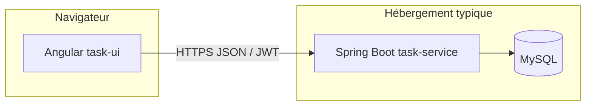

# Atos — démo gestion des tâches et congés

Monorepo : **task-service** (Spring Boot 3, JWT, MySQL) et **task-ui** (Angular 17, Angular Material).

Branche **`demo`** : données fictives, bandeau explicatif, comptes préremplis, calendrier des congés avec chevauchements colorés par employé.

## Démarrage rapide (local)

### Backend (`task-service`)

- Java 22, Maven.
- Variables : `SPRING_DATASOURCE_URL` ou `DB_*`, `DB_USER`, `DB_PASSWORD`, `SECURITY_JWT_SECRET`.
- Démo : `app.demo=true` charge `DemoDataBootstrapRunner` (comptes `demo.admin@atos.fr` / `demo.user@atos.fr`, voir `demo-settings.ts` côté UI).

### Frontend (`task-ui`)

```bash
cd task-ui
npm ci --legacy-peer-deps
npm start
```

- `environment.ts` : `apiUrl` pointant vers `http://localhost:8080/api/v1` par défaut.
- L’URL est normalisée avec le suffixe `/api/v1` si besoin (`api-base-url.ts`).

## Déploiement (rappels)

- **CORS** : `APP_CORS_ALLOWED_ORIGINS` sur l’API (origines HTTPS du frontend, séparées par des virgules).
- **Cloudflare Pages** : la commande de build peut réécrire `environment.prod.ts` ; l’UI démo (bandeau, comptes) vient de `demo-settings.ts`, non écrasé.
- **Santé API** : `GET /actuator/health` (public, sans détail sensible).

## Sécurité — branche démo

Les mots de passe affichés sont **publics volontairement** pour la démonstration. Ne pas réutiliser ce modèle en production (secrets, moindre privilège, durcissement CORS, pas de comptes prévisibles).

## Architecture (aperçu)



## UX / qualité (implémenté sur la branche démo)

- Messages d’erreur réseau / HTTP via `HttpErrorInterceptor` et snackbars ; login avec retour explicite en cas d’échec.
- Garde de route avec message si non connecté.
- Chargement et état vide sur les écrans congés (admin et utilisateur).
- Onglets **Tableau** et **Calendrier** pour les congés : couleurs par employé, infobulles (dates, durée, statut), chevauchements visibles.
- Accessibilité de base sur la page de connexion (labels, `aria-live`, rôles).
- Tests unitaires ciblés (`npm run test:ci`) et workflow GitHub Actions (build backend + tests frontend).

## CI

Voir `.github/workflows/ci.yml` : tests Maven avec profil `test` (H2) et `npm run test:ci` pour le frontend.
